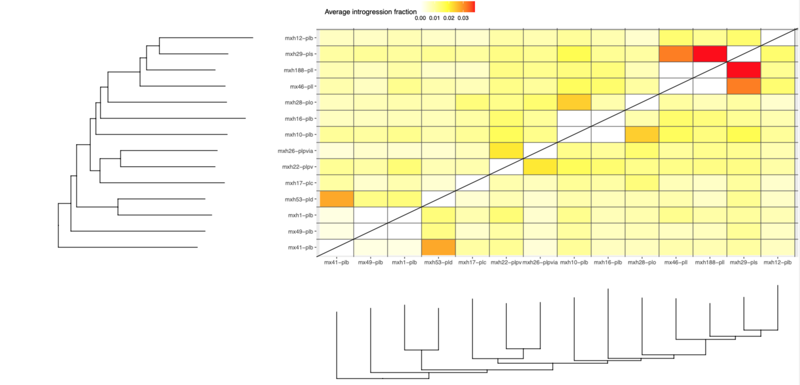
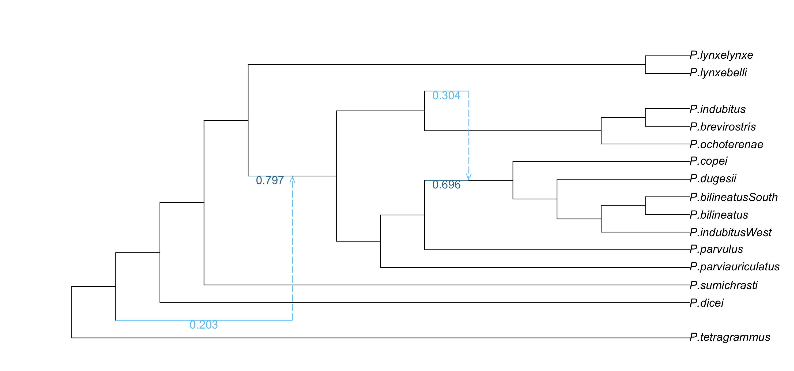

# **Reticulation in the _Plestiodon brevirostris_ Group inferred from UCE Data**

Ahoy.

This pipeline is the workflow used to estimate reticulation in the _Plestiodon brevirostris_ group using 3,282 Ultra-Conserved Elements (UCEs) from [Bryson Jr. et al. 2017](https://doi.org/10.1111/jbi.12989).

To do so, we will be mapping the UCEs to a chromosome-level reference genome and then concatenating UCEs that are within 200,000bps of eachother to approximate 'cogenic' UCEs. Then, we will take the 'psuedo-genes' and continue the analysis with those larger than 1,000bps. With this concatenation scheme we are creating more informative partitions that attempt to be biologically relevant.

## **Data Preparation**

In order to map UCEs on concatenated plestiodonUCE.txt file in the supplementary data of Bryson Jr. et al 2017 needs to be split into each of the 59 individuals
```
counter=0; cat plestiodonUCE.txt | while read LINE; do ((counter++)); echo $LINE > "$counter.txt"; done
```

Then they are manipulated into .fasta format
```
#add carrot in front of name
#!/bin/bash
for i in {2..60}
do
	sed -i '' '1s/^/>/' ${i}.txt
done
```
```
#.txt to .fasta
#!/bin/bash
for i in {2..60}
do
	awk '{ print }' ${i}.txt > ${i}.fas
done
```
OK, so I needed to add a line break after the >sampleID part but I just did it manually. I'm sure you could use sed but I was tired of sed

Now, we split each of the species fastas into UCEs using the partition.txt file from the supplementary material
```
#This script was written by Nathan Whelan.  

library(Biostrings)
specimen <- as.vector(c(2:60))

split <- function(x) {
setwd(paste0("/Users/jonhoff/Documents/AMNH/Thesis_Research/Phylo/Brevirostris_Project/all_ind_fas/", x)); ##Change as needed

##The file name should be a supermatrix in phylip format. Must modify variable names as needed
sequenceData<-unmasked(readAAMultipleAlignment(paste0(x,".fas"),format="fasta"))

##Gene list should be in PartitionFinder format (i.e. GENE_NAME = startPostition-stopPosition;)
##Semicolon at end of each line in gene list is not necessary
table<-read.table("/Users/jonhoff/Documents/AMNH/Thesis_Research/Phylo/Brevirostris_Project/3282partitions_PF-format.txt")
list<-data.frame(do.call('rbind', strsplit(as.character(table$V3),split="-",fixed=TRUE)))
list$X2<-gsub(";","",list$X2)
startVar<-as.data.frame(list$X1)
endVar<-as.data.frame(list$X2)
numberRows<-as.integer(nrow(startVar))

#This for loop will go through and split a supermatrix as specified by gene list
#A single alignment in fasta format will be created for each gene/partition
##See bash script in repository for removing taxa that was not sampled for any given gene output by this for loop
for(n in 1:numberRows){
  subset <- AAStringSet(sequenceData, start=as.integer(as.vector(startVar[n,1])), end=as.integer(as.vector(endVar[n,1])))
  LINE1=toString(n)
  NAME=paste(LINE1,"_UCE.fas",sep="",collapse=NULL)
  writeXStringSet(x=subset, filepath = NAME, format="fasta") #This will give a unique name
  print(n)
  print(subset)
}

}

lapply(specimen, split)
```

Here's a step that annoyed me: removing spaces after the names for each UCE for each species
```
#!/bin/bash
for i in {2..60}
do
 cd all_ind_fas/${i}
	for x in {1..3282}
	do
		sed "s/[[:space:]]*$//g" ${x}_UCE.fas > ${x}_ns.fas
	done
 cd ..
 cd ..
done
```

Last step of the preparation is to rename the UCE fastas to inlcude the UCE number, rather than just the specimen name
```
library(ape)
library(phytools)
library(phylotools)

setwd("/Users/jonhoff/Documents/AMNH/Thesis_Research/Phylo/Brevirostris_Project/all_ind_fas")

#vector list of individuals
critter <- as.vector(c("xxxxxxx","mx41_plb","mx43_pll","mx44_plb","mx46_pll","mx49_plb","mx50_pll","mxh10_plb","mxh11_plb","mxh12_plb","mxh13_plb","mxh14_plb","mxh15_plb","mxh16_plb","mxh17_plc","mxh187_plb","mxh188_pll","mxh189_plpv","mxh18_plb","mxh192_plpv","mxh193_plb","mxh194_plb","mxh19_plb","mxh1_plb","mxh20_plb","mxh21_plpv","mxh22_plpv","mxh25_plpvia","mxh26_plpvia","mxh27_plo","mxh28_plo","mxh29_pls","mxh32_plb","mxh33_plb","mxh34_plb","mxh35_pll","mxh36_pll","mxh37_pll","mxh38_pll","mxh3_pld","mxh40_pld","mxh42_plb","mxh44_out","mxh45_plb","mxh46_plb","mxh4_plpvia","mxh50_plpv","mxh52_plcol","mxh53_pld","mxh54_pll","mxh55_pll","mxh56_pll","mxh57_pll","mxh58_pll","mxh59_pll","mxh5_plc","mxh6_pld","mxh7_plb","mxh8_plb","mxh9_plb"))

#function to rename 
rename <- function(number) {
for (i in 1:3282) {
  df <- data.frame(og_name=c(paste0(critter[number])), new_name=c(paste0(critter[number],"_", i)))
  rename.fasta(paste0(number,"/",i,"_UCE.fas"), df, outfile=paste0(number,"/",i, "_final.fas"))
}
}

#vector to tell function 2-60
dog <- as.vector(c(2:60))

lapply(dog, rename)
```

Now we're ready to blast!

## **Blasting UCEs Against Closest Chromosome-level Reference Genome _Tiliqua scincoides_**

First we need to install blast with Homebrew (we're using MacOs)
```
brew install blast
```

Then, we need to create a custom database to blast against using a downloaded _Tiliqua scincoides_ genome
```
makeblastdb -in GCA_035046505.1_rTilSci1.hap2_genomic.fna -dbtype nucl -out tiliqua
```

Ok, time to blast! Blasting will tell us where these UCEs are located on the genome. For the blasting and some of the subsequent analyses, I used multiple specimens to compare the outputs in order to decide if the final partitions for one specimen will be representative of all specimens.
```
#!/bin/bash
for i in {1..3282}
do 	
	blastn -db tiliqua -query final_UCE_fastas/${i}_final.fas -out blast_output_tiliqua/UCE_${i}.txt -strand plus -outfmt 6
done
```
The -outfmt 6 specification gives us blast results with the following headers:


70 of the UCEs from the original study did not have any blast hits. They were removed from further analyses. 

Now we sort the blast results to isolate the best hit for each UCE
```
#!/bin/bash
for i in {1..3282}
do 
	sort -k1,1 -k12,12nr -k11,11n  blast_output_tiliqua/UCE_${i}.txt | sort -u -k1,1 --merge > blast_output_tiliqua/besthit/bUCE_${i}.txt
done
```

Finally, we concatenate all of the blast ouputs from all the UCEs back into one file
```
setwd("~/Documents/AMNH/Thesis_Research/Phylo/Brevirostris_Project/blast_output_tiliqua/besthit")


list.files()
uces <- list.files()

datalist <- lapply(uces, function(x)read.table(x, header=F))
datafr <- do.call("rbind", datalist)

write.csv(datafr, file = "all_UCE_blast.csv", row.names = FALSE)
```
## **Creating Psuedo-Genes**

First, we need to install [Bedtools](https://bedtools.readthedocs.io/en/latest/), which is a toolset for genome arithmetic
```
brew tap homebrew/science
brew install bedtools
```

Now we have to create a BED file, which is a tab delimited file with the columns Chromosome Start End Name. It is important to note that for the analyses here, the start position needs to be smaller than the end position. Our blast run gave us results from both the positive and negative strands, so this is not the case currently. In excel, we swapped the Start and End numbers for blast hits on the negative strand.

Also in excel, we took the out blast output columns (qseqid sseqid pident length mismatch gapopen qstart qend sstart send evalue bitscore), we created a BEDFILE by moving sseqid sstart send qseqid to a new file, exporiting as a tab-delimited file, and changing the suffix to .BED

To merge and list the UCEs that are within 200kbps of eachother, the bedfile needs to be sorted by chromosome and position on chromosome
```
sort -k1,1 -k2,2n mxh9_plus.bed > mxh9_sorted.bed
```

Merge and list UCEs that are within 200kbps of each other 
```
bedtools merge -i mxh9_sorted.bed -d 200000 -c 4 -o collapse > mxh9_merged.bed
```
This results in concatenating the 3,282 UCEs into 845 psuedo-genes


Now we come to yet another non-efficient step: creating a mapfile with the new partitions and the UCEs that belong to them.

To start, we pasted the merged bedfile into excel and gave each partition a name, removed the UCE_ from each UCE name, and deleted the start and end columns. What was left was a Partition column and a UCE Number column. We saved this as a CSV and used pandas to split the lists in the UCE number column and assign them to new rows with the appropriate Partition. 
```
#in python
#Create a map file (Partition,UCE)
import pandas as pd

#Load data
data = pd.read_csv('partition_uce_mx41.csv')

#Split text into a list
data['UCE'] = data['UCE'].str.split(',')

#Convert list into multiple rows
data = data.explode('UCE')

#Export data
data.to_csv('partitionUCE_map.csv', index=False)
```

Now that we have a map file, we can concatenate the UCEs that share a Partition
```
#in R
setwd("/Users/jonhoff/Documents/AMNH/Thesis_Research/Phylo/Brevirostris_Project")
#Load packages
library(Biostrings)
library(seqinr)
length(dataframe$Partition)

#read in map file
dataframe = read.csv("partitionUCE_map.csv")

critter <- as.vector(c("xxxxxxx","mx41_plb","mx43_pll","mx44_plb","mx46_pll","mx49_plb","mx50_pll","mxh10_plb","mxh11_plb","mxh12_plb","mxh13_plb","mxh14_plb","mxh15_plb","mxh16_plb","mxh17_plc","mxh187_plb","mxh188_pll","mxh189_plpv","mxh18_plb","mxh192_plpv","mxh193_plb","mxh194_plb","mxh19_plb","mxh1_plb","mxh20_plb","mxh21_plpv","mxh22_plpv","mxh25_plpvia","mxh26_plpvia","mxh27_plo","mxh28_plo","mxh29_pls","mxh32_plb","mxh33_plb","mxh34_plb","mxh35_pll","mxh36_pll","mxh37_pll","mxh38_pll","mxh3_pld","mxh40_pld","mxh42_plb","mxh44_out","mxh45_plb","mxh46_plb","mxh4_plpvia","mxh50_plpv","mxh52_plcol","mxh53_pld","mxh54_pll","mxh55_pll","mxh56_pll","mxh57_pll","mxh58_pll","mxh59_pll","mxh5_plc","mxh6_pld","mxh7_plb","mxh8_plb","mxh9_plb"))


for (j in 2:60) {
  setwd(paste0("/Users/jonhoff/Documents/AMNH/Thesis_Research/Phylo/Brevirostris_Project/all_ind_fas/", j))
      
  for (i in 1:845) {
    dog = dataframe$UCE[dataframe$Partition == i]
    write.table(dog, file = paste0(i, ".txt"), append = FALSE, sep = "/t", dec = ".",
                row.names = FALSE, col.names = FALSE, quote = FALSE)}
    
  for (i in 1:845) {
    #Read the list of FASTA files from the text file
    fasta_list_file <- paste0(i, ".txt") # Replace with the path to your text file
    fasta_files <- readLines(fasta_list_file)
  
    #Function to read FASTA files and store sequences in a list
    read_fasta_files <- function(fasta_files) {
    lapply(fasta_files, function(fasta_file) {
      if (file.exists(fasta_file)) {
        readDNAStringSet(fasta_file)
      } else {
        warning(paste("File not found:", fasta_file))
        NULL
      }
     })
    }
  
    #Read the sequences from the FASTA files
    fasta_sequences <- read_fasta_files(fasta_files)
  
    #concatenate
    concatenate_sequences <- function(fasta_sequences) {
     all_sequences <- DNAString()
     for (seq_set in fasta_sequences) {
        if (!is.null(seq_set)) {
          all_sequences <- c(all_sequences, unlist(seq_set))
        }
      }
      return(all_sequences)
    }
  
    #Get the concatenated sequence
    concatenated_sequence <- concatenate_sequences(fasta_sequences)
  
    #write concatenated sequence
    write.fasta(concatenated_sequence, c(paste0("partition_", i)), paste0("/Users/jonhoff/Documents/AMNH/Thesis_Research/Phylo/Brevirostris_Project/PSEUDOCHROM_PARTITIONED_UCES/", critter[j], "/p", i, ".fas"))
  }
}
```

Now to rename each psuedo-gene to just the name of the species for donwstream analysis
```
library(ape)
library(phytools)
library(phylotools)

setwd("/Users/jonhoff/Documents/AMNH/Thesis_Research/Phylo/Brevirostris_Project")

#vector list of individuals
critter <- as.vector(c("xxxxxxx","mx41_plb","mx43_pll","mx44_plb","mx46_pll","mx49_plb","mx50_pll","mxh10_plb","mxh11_plb","mxh12_plb","mxh13_plb","mxh14_plb","mxh15_plb","mxh16_plb","mxh17_plc","mxh187_plb","mxh188_pll","mxh189_plpv","mxh18_plb","mxh192_plpv","mxh193_plb","mxh194_plb","mxh19_plb","mxh1_plb","mxh20_plb","mxh21_plpv","mxh22_plpv","mxh25_plpvia","mxh26_plpvia","mxh27_plo","mxh28_plo","mxh29_pls","mxh32_plb","mxh33_plb","mxh34_plb","mxh35_pll","mxh36_pll","mxh37_pll","mxh38_pll","mxh3_pld","mxh40_pld","mxh42_plb","mxh44_out","mxh45_plb","mxh46_plb","mxh4_plpvia","mxh50_plpv","mxh52_plcol","mxh53_pld","mxh54_pll","mxh55_pll","mxh56_pll","mxh57_pll","mxh58_pll","mxh59_pll","mxh5_plc","mxh6_pld","mxh7_plb","mxh8_plb","mxh9_plb"))

rename <- function(number) {
for (i in 1:845) {
  df <- data.frame(og_name=c(paste0("partition_", i)), new_name=c(critter[number]))
  rename.fasta(paste0("/Users/jonhoff/Documents/AMNH/Thesis_Research/Phylo/Brevirostris_Project/PSEUDOCHROM_PARTITIONED_UCES/",critter[number],"/p",i,".fas"), df, outfile=paste0("/Users/jonhoff/Documents/AMNH/Thesis_Research/Phylo/Brevirostris_Project/PSEUDOCHROM_PARTITIONED_UCES/",critter[number],"/",i, "_final.fas"))
  }
}

#vector to tell function 2-60
hog <- as.vector(c(2:60))

lapply(hog, rename)
```

Then concatenate each psuedo-gene with the same psuedo-gene from each specimen
```
#!/bin/bash
for i in {1..845}
do
	cat */${i}_final.fas > concat-gene-file-for-each-gene/gene_${i}.fas
done
```

After this was complete, I removed all of the psudeo-genes that were shorter than 1kbps (i.e., >2 UCEs concatenated) as they are less informative. This brings the number of pseudo-genes from 845 to 340.

OK, cool! Now we're all set to infer gene trees, a species tree, and introgression

## **Infer Gene Trees with IQ-TREE**

The first step in this project is to take the aligned UCE data and use [IQ-TREE](https://github.com/iqtree/iqtree2) to infer unrooted gene trees for each of the 3,282 UCEs
```
/Users/jonhoff/Documents/AMNH/Thesis_Research/Phylo/iqtree/bin/iqtree2 -S /Users/jonhoff/Documents/AMNH/Thesis_Research/Phylo/Brevirostris_Project/FINAL_GENES_OVER1kb --prefix loci -T AUTO
```

## **Infer Species Tree with ASTRALIII**

Now that we have gene trees from IQtree2, we can use [ASTRALIII](https://github.com/smirarab/ASTRAL) to infer an unrooted species tree. ASTRALIII is a is a tool for estimating an unrooted species tree given a set of unrooted gene trees. ASTRAL is statistically consistent under the multi-species coalescent model, allowing for appropriate inference of Incomplete Lineage Sorting (ILS) and introgression. 
```
java -jar /Users/jonhoff/Documents/AMNH/Thesis_Research/Phylo/Astral/astral.5.7.8.jar -i /Users/jonhoff/Documents/AMNH/Thesis_Research/Phylo/Brevirostris_Project/IQTREE_results/Gene-Trees1KB/loci.treefile -o sp.tre
```
## **Rooting and Pruning Trees**

In order to compleate further analyses, we must root the trees to the outgroup and prune them to have only one individual per species
```
#in R
##Root
library(ape)
setwd("/Users/jonhoff/Documents/AMNH/Thesis_Research/Phylo/Brevirostris_Project/IQTREE_results")

#species tree
sp = read.tree("Species-Tree/concat.treefile")
outgroup <- "mxh44_out"

unroot(sp)
rootedsp = root(sp, outgroup = outgroup, resolve.root = T)
is.rooted(rootedsp)
write.tree(rootedsp, "Rooted_Species845.tre")

#gene trees
gt = read.tree("Gene-Trees/loci.treefile")
outgroup <- "mxh44_out"

unroot(gt)
rootedgt = root(gt, outgroup = outgroup, resolve.root = T)
is.rooted(rootedgt)
write.tree(rootedgt, "Rooted_Gene845.tre")

##Prune
library(ape)
setwd("/Users/jonhoff/Documents/AMNH/Thesis_Research/Phylo/Brevirostris_Project/")

sp = read.tree("/Users/jonhoff/Documents/AMNH/Thesis_Research/Phylo/Brevirostris_Project/FINAL_TREES/Rooted_Species845.tre")
gt = read.tree("/Users/jonhoff/Documents/AMNH/Thesis_Research/Phylo/Brevirostris_Project/FINAL_TREES/Rooted_Gene845.tre")

tips <- c("mx43_pll", "mxh192_plpv", "mxh46_plb", "mxh9_plb", "mxh27_plo", "mxh35_pll", "mxh187_plb", "mxh37_pll", "mxh8_plb", "mxh52_plcol", "mxh45_plb", "mxh38_pll", "mxh36_pll", "mxh56_pll", "mxh58_pll", "mxh57_pll", "mxh189_plpv", "mx44_plb", "mxh20_plb", "mxh5_plc", "mxh19_plb", "mxh4_plpvia", "mxh21_plpv", "mxh15_plb", "mxh55_pll", "mxh59_pll", "mxh50_plpv", "mxh18_plb", "mxh3_pld", "mx50_pll", "mxh11_plb", "mxh42_plb", "mxh13_plb", "mxh14_plb", "mxh34_plb", "mxh193_plb", "mxh194_plb", "mxh40_pld", "mxh54_pll", "mxh25_plpvia", "mxh7_plb", "mxh33_plb", "mxh6_pld", "mxh32_plb")

pruned.tree <- drop.tip(sp, tips)
plot(pruned.tree)
rot <- root.phylo(pruned.tree, outgroup = "mxh44_out")
write.tree(rot, file= "845psp_r.tre")

pruned.gtree <- drop.tip(gt, tips)
plot(pruned.gtree)
rgt <- root.multiPhylo(pruned.gtree, outgroup = "mxh44_out")
write.tree(rgt, file= "845pgt_r.tre")
```

## **Visualize Gene Tree Discordance**

To initially quanitfy and visualize the gene tree discordance within the clade we used Stephen Smith's [Phyparts](https://bitbucket.org/blackrim/phyparts/src/master/) and an accompanying [visualization script](https://github.com/mossmatters/MJPythonNotebooks/blob/master/PhyParts_PieCharts.ipynb) by Github user mossmatters 

Phyparts
```
java -Xmx16g -jar phyparts/target/phyparts-0.0.1-SNAPSHOT-jar-with-dependencies.jar -a 1 -v -d Brevirostris_Project/FINAL_TREES/Rooted_Gene845.tre -m Brevirostris_Project/FINAL_TREES/Rooted_Species845.tre -o Brevirostris_Project/845Phyparts_out/out
```

Make piecharts (Note: make sure to remove the word 'Root' from the species tree and the phyparts output treefile)
```
python phyparts/piecharts.py species.tree Brevirostris_Project/845Phyparts_out/out 845 --show_nodes --svg_name out.svg
```

This is what the output will look like

Blue: Support the shown topology
Green: Conflict with the shown topology (most common conflicting bipartion)
Red: Conflict with the shown topology (all other supported conflicting bipartitions)
Gray: Have no support for conflicting bipartion


## **Estimate Introgression with QuIBL**

Now we are going to estimate the directionality and degree of reticulation using [QuIBL](https://github.com/miriammiyagi/QuIBL) which "is a program for detecting introgressed loci and characterizing introgression events in a species network. It takes a set of gene trees as input and estimates the proportion of introgressed loci as well as the timing of an introgression pulse triplet by triplet"

In order to run QuIBL, we first need to download the QuIBL.py and quible_requirements.txt files from the github. Then, we make sure the dependencies are installed:
```
pip install -r quibl_requirements.txt
```

Then we have to make an input file:
```
[Input]
treefile: ./340sgt_r1kb.tre
numdistributions: 2
likelihoodthresh: 0.01
numsteps: 50
gradascentscalar: 0.5
totaloutgroup: mxh44_out
multiproc: True
maxcores:40


[Output]
OutputPath: ./340pgt_r1kb_out.csv
```

Finally we can run QuIBL:
```
#!/bin/sh
#SBATCH --job-name brev_quibl
#SBATCH --nodes=1
#SBATCH --mem=50gb
#SBATCH --time=500:00:00
#SBATCH --mail-type=ALL
#SBATCH --tasks-per-node=40
#SBATCH --mail-user=jhoffman1@amnh.org
#SBATCH --output=slurm-%j-%x.out

export OMP_NUM_THREADS=$SLURM_NTASKS_PER_NODE

source ~/.bash_profile
conda activate quibl
python QuIBL.py ./brev_inputfile.txt
```

To view the outcome, we use QuIBLR
```
#devtools::install_github("nbedelman/quiblR")
library("quiblR")
library("ggplot2")
library("ape")
library("hash")
library("ggtree")
library("ggpubr")
library("dplyr")
library("phytools")
setwd("/Users/jonhoff/Documents/AMNH/Thesis_Research/Phylo/Brevirostris_Project/QuIBL")

speciesTree <-  read_speciesTree("340psp_r1kb.tre")
quiblOutput <- read_csv_quibl("340pgt_r1kb_out.csv")
originalTrees <- read.tree("340pgt_r1kb.tre")
speciesTree <- as.phylo(speciesTree)


#edit names##########
uni_under <- unique(quiblOutput$outgroup)
uni_dash <- gsub("_","-",uni_under)
for(u in 1:length(uni_under)){
  quiblOutput$triplet <-  gsub(uni_under[u],uni_dash[u],quiblOutput$triplet)
  quiblOutput$outgroup <-  gsub(uni_under[u],uni_dash[u],quiblOutput$outgroup)
}


plot(speciesTree)

totalTrees <- sum(quiblOutput$count)/length(unique(quiblOutput$triplet))


#if you get an error, make sure you have replaces _ with - in species tree
quiblOutput <- mutate(quiblOutput,
               isDiscordant = as.integer(! apply(quiblOutput, 1, isSpeciesTree, sTree= 
              speciesTree)), isSignificant = as.integer(apply(quiblOutput, 1, testSignificance, threshold=10)), totalIntrogressionFraction=(mixprop2*count*isDiscordant)/totalTrees)


#head(largeQuiblOutput)

introgressionSummary <- getIntrogressionSummary(quiblOut = quiblOutput, speciesTree = speciesTree)


#make heat map
summaryMatrix <- ggplot(data = introgressionSummary, aes(tax1, tax2, fill = value))+
  geom_tile(color = "white")+
  scale_fill_gradient2(low = "white", high = "red", mid = "yellow",na.value = "grey50",
                       midpoint = max(introgressionSummary$value)/2, limit = c(0,max(introgressionSummary$value)),
                       name="Average introgression fraction") +
  geom_abline(slope = 1, intercept=0)+
  geom_vline(xintercept=seq(1.5,nrow(introgressionSummary)+0.5,1), alpha=0.6)+
  geom_hline(yintercept=seq(1.5,nrow(introgressionSummary)+0.5,1), alpha=0.6)+
  labs(x="", y="")+
  #scale_x_discrete(position = "top") +
  theme(panel.grid = element_blank(),legend.position = "none")


#SummaryMatrix

speciesTreeSubset <- ggtree(extractTripletTree(speciesTree, unique(introgressionSummary$tax1)))

speciesTreeSubset_down <- ggtree(extractTripletTree(speciesTree, unique(introgressionSummary$tax1)))+ coord_flip()

#speciesTreeSubset

ggarrange(  speciesTreeSubset, summaryMatrix,NULL, speciesTreeSubset_down,
            ncol = 2,nrow=2, heights=c(2,1), widths=c(1,2), align="hv",common.legend = TRUE)
```

The resulting heatmap looks like this:


## **SnaQ**

Now we will use [SnaQ](https://solislemuslab.github.io/snaq-tutorial/) to hypothesize phylogenetic relations in a while accouting for gene-flow

First, we must create a quartet file to input to SnaQ
```
#Written by: Dylan DeBaun
	#alterated by: Jon Hoffman

#Can create quartet files for SnaQ
#load libraries
 library('MSCquartets')
 library('ape')
 library('gtools')
 library('stringr')
 setwd("/Users/jonhoff/Documents/AMNH/Thesis_Research/Phylo/Brevirostris_Project/SnaQ/")
 #load species treesearch/Phylo/SnaQ/Brev96/")
 snake_tree <-read.tree("340psp_r1kb.tre")
 
 #load gene trees
 genedata_ind = "340pgt_r1kb.tre"
 gtrees_ind <- read.tree(genedata_ind)
 
 #INPUTS
 species = read.delim("brev_species.txt", header  = F) #list of species, with the last species being the outgroup species
 outgroup = species$V1[15]r  = F) #list of species, with the last species being the outgroup species
 indivs <- read.delim("brev_individuals.txt",header  = F) #list of species, with the last species being the outgroup species
 indivs <- indivs$V1ader  = F) #list of species, with the last species being the outgroup species
 group = "brev340" #prefix for the clade
 
 #Create the quartet file for SnaQ
 b <- quartetTable(gtrees_ind,taxonnames=indivs,random = 0) #make quartet table at individual level
 x <- b[rowSums(b) !=4, colSums(b) !=0] #edit it to look the way we want for snaq,random = 0) #make quartet table at individual level
 y<- matrix(rep(0,dim(x)[1]*8),ncol = 8,nrow=dim(x)[1])
 colnames(y)<-c("t1","t2","t3","t4","CF12_34","CF13_24","CF14_23","ngenes")m(x)[1])
 for(i in 1:dim(x)[1]){CF13_24","CF14_23","ngenes")
   count=0
   for(j in 1:dim(x)[2]){
     if(x[i,j] == 1){
       count = count+1
       y[i,count] = colnames(x)[j]
     }
   }
   y[i,"ngenes"] = x[i,dim(x)[2]-2] + x[i,dim(x)[2]-1]+x[i,dim(x)[2]]
   y[i,"CF12_34"] = as.numeric(x[i,dim(x)[2]-2])/as.numeric(y[i,"ngenes"]))[2]-1]+x[i,dim(x)[2]]
   y[i,"CF13_24"] = as.numeric(x[i,dim(x)[2]-1])/as.numeric(y[i,"ngenes"]))/as.numeric(y[i,"ngenes"])
   y[i,"CF14_23"] = as.numeric(x[i,dim(x)[2]])/as.numeric(y[i,"ngenes"]))/as.numeric(y[i,"ngenes"])
 }as.numeric(y[i,"ngenes"])
write.csv(y, paste0(group,"_individualsCFs.csv"), row.names = F)
```

Now we must create a julia script to run SnaQ
```
#written by Dylan DeBaun
using PhyloNetworks, CSV, DataFrames

group = "brev340" # outfile prefix, also the name of the directory with all the input files
numretic = 3 #number of hybridizations to look for

print(group);
print(numretic);

cd(group);

#read in the tree, mapping, and indiv level concordance factor file (made in prep.R)
astraltree=readTopology(string(group,".tre"));
cf = string(group,"_individualsCFs.csv");
mappingFile = string(group,"_map.csv");

#make a species level cf file, write to folder
df_sp = mapAllelesCFtable(mappingFile, cf);
d_sp = readTableCF!(df_sp);
df_sp = writeTableCF(d_sp);
CSV.write(string(group,"CFtable_species.csv"),df_sp)

#run snaq
x=parse(Int64, numretic)
net = snaq!(astraltree,d_sp, hmax=x, filename=string("net",numretic,group), seed=2345);
```
I created a .jl file for each of the number of reticulation events to look for (1-5)

Run SnaQ
```
#!/bin/sh
#SBATCH --job-name brev_snaq
#SBATCH --nodes=1
#SBATCH --mem=50gb
#SBATCH --time=500:00:00
#SBATCH --mail-type=ALL
#SBATCH --tasks-per-node=40
#SBATCH --mail-user=jhoffman1@amnh.org
#SBATCH --output=slurm-%j-%x.out

source ~/.bash_profile
julia runsnaq.jl
```

To visualize the output from each SnaQ run, we use the following code in Julia
```
using PhyloNetworks
using PhyloPlots
brev = readMultiTopology("net2brev96.networks")
brev = brev[1] #select the network with the lowest psuedo-likelihood
rootatnode!(brev, "P.tetragrammus")
plot(brev, :R, showGamma=true)
```

The network should look like this:



